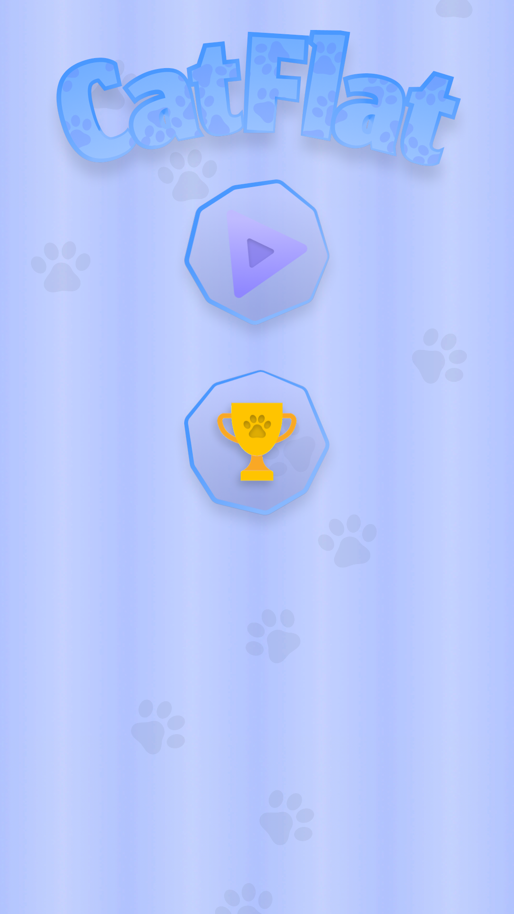
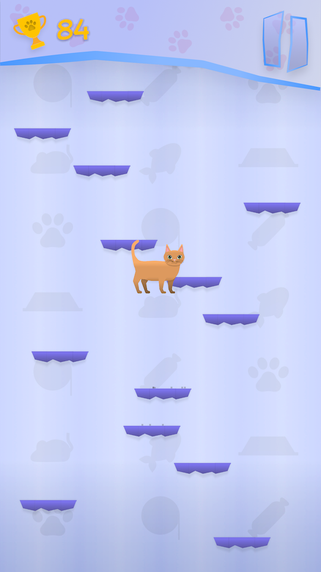
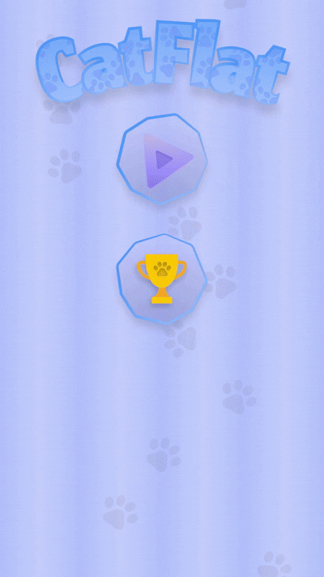

# CatFlat

🛰️ **2D PLatformer** like Doodle Jump.  
Developed solo as a portfolio project using Unity, C# and Figma.
---

## 🎯 Project Goal

CatFlat is being developed to demonstrate proficiency in Unity development for mobile and PC/WebGL platforms.  
This project focuses on:

- Clean and scalable C# architecture (ScriptableObjects, event systems, interface segregation)
- UI systems with menu and liderboard
- Small effects and animation
- Full solo production: code, design, objects, and logic

---

## 🎮 Gameplay Overview

> You play as a little cat, climbing higher and higher.

- Various platform types (high-jump boost, breakable, moving)
- Leaderboard
- Score increases as you climb higher

---

## 🛠️ Technologies Used

- **Unity 2022.3 (URP)**
- **C#**
- **Figma** for UI and 2D-objects
- **GitHub** for version control and project history

---

## 🚀 Features

- ✅ Player movement (left/right)
- ✅ Adorable cat character
- ✅ Various platform types
- ✅ Dynamic platform generation
- ✅ Score-based progression
- ✅ Leaderboard
- ✅ Multiple menu screens
- ✅ Simple animations and effects

---

## 📅 Roadmap

| Feature                     | Status      |
|-----------------------------|-------------|
| Basic gameplay loop         | ✅ Done     |
| Main menu and gameplay menu | ✅ Done     |
|  Various platform types     | ✅ Done     |
| Dynamic platform generation | ✅ Done     |
| Visual graphics             | ✅ Done     |
| Release & feedback          | ✅ Done     |

---

## 🎥 Media

---

## 👤 Author

**Alexey** — Unity Developer (Russia)  
🧠 Self-taught + Unity Learn graduate  
💻 Portfolio project for future career in game development  

📫 Contact: alhov271@gmail.com  
🔗 GitHub: [@Lohus](https://github.com/Lohus)

---

## 📌 License

MIT License. You may explore the code and architecture for learning purposes.